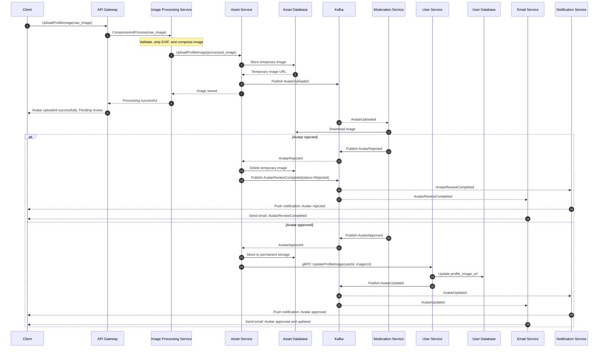

# Profile Image Update Flow

```mermaid
sequenceDiagram
    autonumber

    participant Client
    participant Gateway as API Gateway
    participant Processor as Image Processing Service
    participant Asset as Asset Service
    participant AssetDB as Asset Database
    participant Kafka
    participant Moderation as Moderation Service
    participant User as User Service
    participant UserDB as User Database
    participant Email as Email Service
    participant Notification as Notification Service

    Client->>Gateway: UploadProfileImage(raw_image)
    Gateway->>Processor: CompressAndProcess(raw_image)
    
    Note over Processor: Validate, strip EXIF, and compress image
    
    Processor->>Asset: UploadProfileImage(processed_image)

    Asset->>AssetDB: Store temporary image
    AssetDB-->>Asset: Temporary image URL

    Asset->>Kafka: Publish AvatarUploaded

    Asset-->>Processor: Image stored
    Processor-->>Gateway: Processing successful
    Gateway-->>Client: Avatar uploaded successfully. Pending review.

    Kafka-->>Moderation: AvatarUploaded

    Moderation->>AssetDB: Download image

    alt Avatar rejected

        Moderation->>Kafka: Publish AvatarRejected

        Kafka-->>Asset: AvatarRejected

        Asset->>AssetDB: Delete temporary image

        Asset->>Kafka: Publish AvatarReviewCompleted(status=Rejected)

        Kafka-->>Notification: AvatarReviewCompleted

        Kafka-->>Email: AvatarReviewCompleted

        Notification-->>Client: Push notification: Avatar rejected

        Email-->>Client: Send email: AvatarReviewCompleted

    else Avatar approved

        Moderation->>Kafka: Publish AvatarApproved

        Kafka-->>Asset: AvatarApproved

        Asset->>AssetDB: Move to permanent storage

        Asset->>User: gRPC UpdateProfileImage(userId, imageUrl)

        User->>UserDB: Update profile_image_url

        User->>Kafka: Publish AvatarUpdated

        Kafka-->>Notification: AvatarUpdated
        Kafka-->>Email: AvatarUpdated

        Notification-->>Client: Push notification: Avatar approved
        Email-->>Client: Send email: Avatar approved and updated

    end
```
