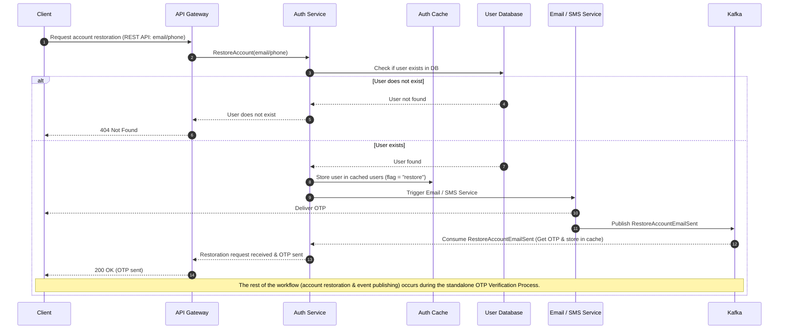

# Restore User Flow

```mermaid
sequenceDiagram
    autonumber

    participant Client
    participant Gateway as API Gateway
    participant Auth as Auth Service
    participant AuthCache as Auth Cache
    participant UserDB as User Database
    participant EmailSMS as Email / SMS Service
    participant Kafka

    %% --- RESTORE USER INITIAL REQUEST ---
    Client->>Gateway: Request account restoration (REST API: email/phone)
    Gateway->>Auth: RestoreAccount(email/phone)

    Auth->>UserDB: Check if user exists in DB

    alt User does not exist
        UserDB-->>Auth: User not found
        Auth-->>Gateway: User does not exist
        Gateway-->>Client: 404 Not Found
    else User exists
        UserDB-->>Auth: User found

        Auth->>AuthCache: Store user in cached users (flag = "restore")

        Auth->>EmailSMS: Trigger Email / SMS Service
        EmailSMS-->>Client: Deliver OTP

        EmailSMS->>Kafka: Publish RestoreAccountEmailSent
        Kafka-->>Auth: Consume RestoreAccountEmailSent (Get OTP & store in cache)

        Auth-->>Gateway: Restoration request received & OTP sent
        Gateway-->>Client: 200 OK (OTP sent)

        Note over Client, Kafka: The rest of the workflow (account restoration & event publishing) occurs during the standalone OTP Verification Process.
    end
```
