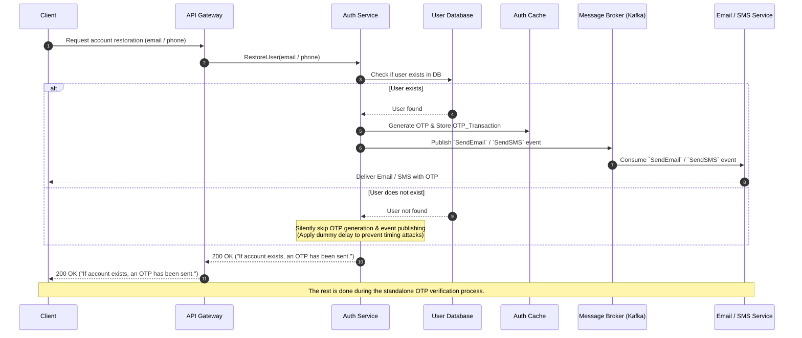

# Restore User Flow

```mermaid
sequenceDiagram
    autonumber

    participant Client
    participant Gateway as API Gateway
    participant Auth as Auth Service
    participant UserDB as User Database
    participant AuthCache as Auth Cache
    participant Kafka as Message Broker (Kafka)
    participant EmailSMS as Email / SMS Service

    %% --- RESTORE USER REQUEST ---
    Client->>Gateway: Request account restoration (email / phone)
    Gateway->>Auth: RestoreUser(email / phone)

    Auth->>UserDB: Check if user exists in DB

    alt User exists
        UserDB-->>Auth: User found

        %% 1. Generate & Store OTP
        Auth->>AuthCache: Generate OTP & Store OTP_Transaction

        %% 2. Asynchronously Publish Event
        Auth->>Kafka: Publish `SendEmail` / `SendSMS` event

        %% 3. Consumer handles delivery
        Kafka->>EmailSMS: Consume `SendEmail` / `SendSMS` event
        EmailSMS-->>Client: Deliver Email / SMS with OTP

    else User does not exist
        UserDB-->>Auth: User not found

        %% Security: Do not reveal account status
        Note over Auth: Silently skip OTP generation & event publishing<br/>(Apply dummy delay to prevent timing attacks)
    end

    %% Unified Secure Response
    Auth-->>Gateway: 200 OK ("If account exists, an OTP has been sent.")
    Gateway-->>Client: 200 OK ("If account exists, an OTP has been sent.")

    Note over Client, EmailSMS: The rest is done during the standalone OTP verification process.
```
