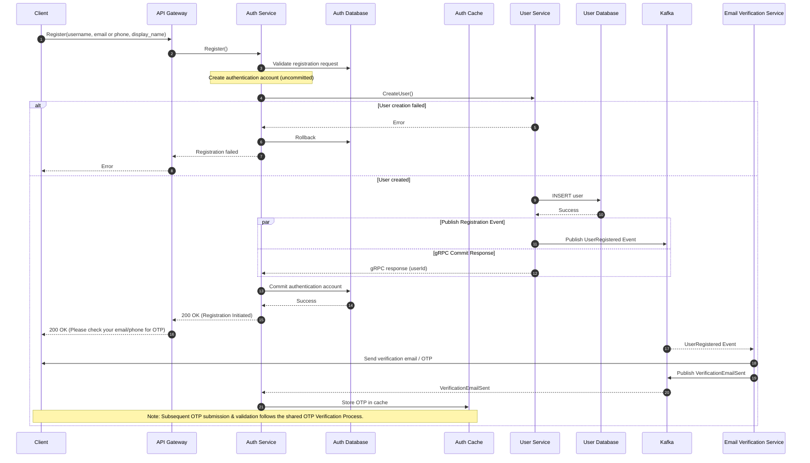

# User Creation Sequence Diagram

```mermaid
sequenceDiagram
    autonumber

    participant Client
    participant Gateway as API Gateway
    participant Auth as Auth Service
    participant AuthDB as Auth Database
    participant AuthCache as Auth Cache
    participant User as User Service
    participant UserDB as User Database
    participant Kafka
    participant Email as Email Verification Service

    %% --- REGISTRATION INITIALIZATION ---
    Client->>Gateway: Register(username, email or phone, display_name)
    Gateway->>Auth: Register()

    Auth->>AuthDB: Validate registration request

    Note over Auth: Create authentication account (uncommitted)

    Auth->>User: CreateUser()

    alt User creation failed
        User-->>Auth: Error
        Auth->>AuthDB: Rollback
        Auth-->>Gateway: Registration failed
        Gateway-->>Client: Error

    else User created
        User->>UserDB: INSERT user
        UserDB-->>User: Success

        par Publish Registration Event
            User->>Kafka: Publish UserRegistered Event
        and gRPC Commit Response
            User-->>Auth: gRPC response (userId)
        end

        Auth->>AuthDB: Commit authentication account
        AuthDB-->>Auth: Success

        Auth-->>Gateway: 200 OK (Registration Initiated)
        Gateway-->>Client: 200 OK (Please check your email/phone for OTP)

        %% --- ASYNC VERIFICATION & OTP DISPATCH ---
        Kafka-->>Email: UserRegistered Event

        Email->>Client: Send verification email / OTP
        Email->>Kafka: Publish VerificationEmailSent

        Kafka-->>Auth: VerificationEmailSent
        Auth->>AuthCache: Store OTP in cache

        Note over Client, AuthCache: Note: Subsequent OTP submission & validation follows the shared OTP Verification Process.
    end
```
