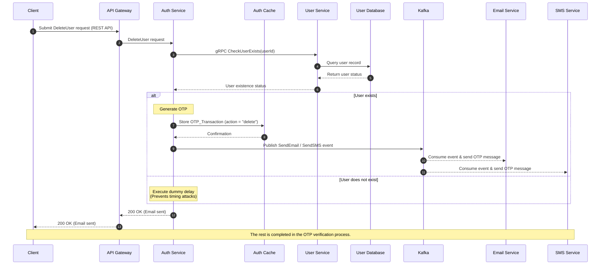

# User Deletion Flow

```mermaid
sequenceDiagram
    autonumber

    participant Client
    participant Gateway as API Gateway
    participant Auth as Auth Service
    participant AuthCache as Auth Cache
    participant User as User Service
    participant UserDB as User Database
    participant Kafka
    participant Email as Email Service
    participant SMS as SMS Service

    %% --- DELETE USER REQUEST ---
    Client->>Gateway: Submit DeleteUser request (REST API)
    Gateway->>Auth: DeleteUser request

    %% --- USER EXISTENCE CHECK ---
    Auth->>User: gRPC CheckUserExists(userId)
    User->>UserDB: Query user record
    UserDB-->>User: Return user status
    User-->>Auth: User existence status

    alt User exists
        Note over Auth: Generate OTP

        Auth->>AuthCache: Store OTP_Transaction (action = "delete")
        AuthCache-->>Auth: Confirmation

        Auth->>Kafka: Publish SendEmail / SendSMS event
        Kafka-->>Email: Consume event & send OTP message
        Kafka-->>SMS: Consume event & send OTP message

    else User does not exist
        Note over Auth: Execute dummy delay<br/>(Prevents timing attacks)
    end

    %% --- UNIFORM RESPONSE ---
    Auth-->>Gateway: 200 OK (Email sent)
    Gateway-->>Client: 200 OK (Email sent)

    Note over Client, SMS: The rest is completed in the OTP verification process.
```
