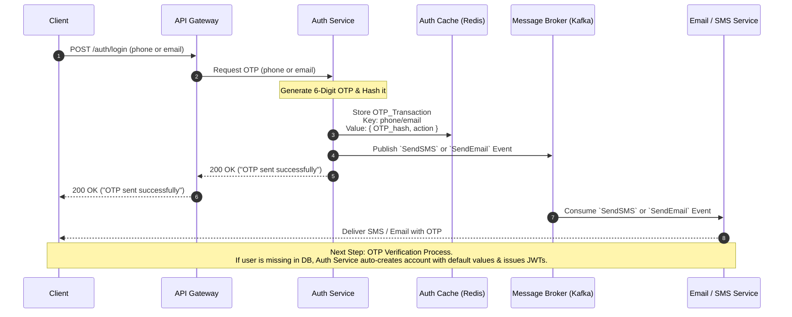

# User Creation Sequence Diagram

```mermaid
sequenceDiagram
    autonumber

    participant Client
    participant Gateway as API Gateway
    participant Auth as Auth Service
    participant AuthCache as Auth Cache (Redis)
    participant Kafka as Message Broker (Kafka)
    participant EmailSMS as Email / SMS Service

    %% --- UNIFIED LOGIN / OTP REQUEST ---
    Client->>Gateway: POST /auth/login (phone or email)
    Gateway->>Auth: Request OTP (phone or email)

    Note over Auth: Generate 6-Digit OTP & Hash it

    Auth->>AuthCache: Store OTP_Transaction<br/>Key: phone/email<br/>Value: { OTP_hash, action }

    Auth->>Kafka: Publish `SendSMS` or `SendEmail` Event

    Auth-->>Gateway: 200 OK ("OTP sent successfully")
    Gateway-->>Client: 200 OK ("OTP sent successfully")

    %% --- ASYNC OTP DELIVERY ---
    Kafka->>EmailSMS: Consume `SendSMS` or `SendEmail` Event
    EmailSMS-->>Client: Deliver SMS / Email with OTP

    Note over Client, EmailSMS: Next Step: OTP Verification Process.<br/>If user is missing in DB, Auth Service auto-creates account with default values & issues JWTs.
```
