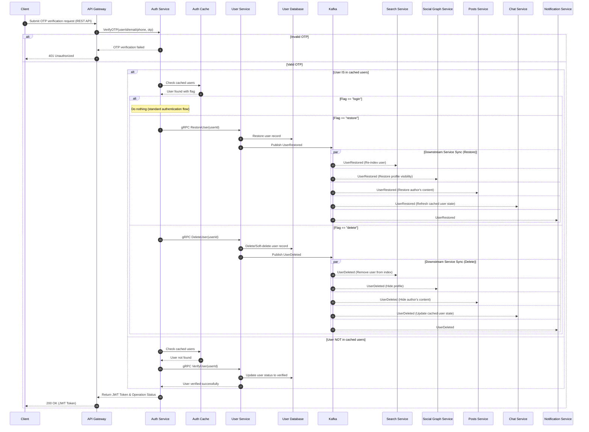

# Verify OTP Flow done in the Auth Service

```mermaid
sequenceDiagram
    autonumber

    participant Client
    participant Gateway as API Gateway
    participant Auth as Auth Service
    participant AuthCache as Auth Cache
    participant User as User Service
    participant UserDB as User Database
    participant Kafka
    participant Search as Search Service
    participant Social as Social Graph Service
    participant Posts as Posts Service
    participant Chat as Chat Service
    participant Notification as Notification Service

    %% --- OTP VERIFICATION REQUEST ---
    Client->>Gateway: Submit OTP verification request (REST API)
    Gateway->>Auth: VerifyOTP(userId/email/phone, otp)

    alt Invalid OTP
        Auth-->>Gateway: OTP verification failed
        Gateway-->>Client: 401 Unauthorized
    else Valid OTP

        %% --- CACHED USERS EVALUATION ---
        alt User IS in cached users
            Auth->>AuthCache: Check cached users
            AuthCache-->>Auth: User found with flag

            alt Flag == "login"
                Note over Auth: Do nothing (standard authentication flow)

            else Flag == "restore"
                Auth->>User: gRPC RestoreUser(userId)
                User->>UserDB: Restore user record
                User->>Kafka: Publish UserRestored

                par Downstream Service Sync (Restore)
                    Kafka-->>Search: UserRestored (Re-index user)
                and
                    Kafka-->>Social: UserRestored (Restore profile visibility)
                and
                    Kafka-->>Posts: UserRestored (Restore author's content)
                and
                    Kafka-->>Chat: UserRestored (Refresh cached user state)
                and
                    Kafka-->>Notification: UserRestored
                end

            else Flag == "delete"
                Auth->>User: gRPC DeleteUser(userId)
                User->>UserDB: Delete/Soft-delete user record
                User->>Kafka: Publish UserDeleted

                par Downstream Service Sync (Delete)
                    Kafka-->>Search: UserDeleted (Remove user from index)
                and
                    Kafka-->>Social: UserDeleted (Hide profile)
                and
                    Kafka-->>Posts: UserDeleted (Hide author's content)
                and
                    Kafka-->>Chat: UserDeleted (Update cached user state)
                and
                    Kafka-->>Notification: UserDeleted
                end
            end

        else User NOT in cached users
            Auth->>AuthCache: Check cached users
            AuthCache-->>Auth: User not found
            Auth->>User: gRPC VerifyUser(userId)
            User->>UserDB: Update user status to verified
            User-->>Auth: User verified successfully
        end

        %% --- FINAL RESPONSE & TOKEN ISSUANCE ---
        Auth-->>Gateway: Return JWT Token & Operation Status
        Gateway-->>Client: 200 OK (JWT Token)
    end
```
