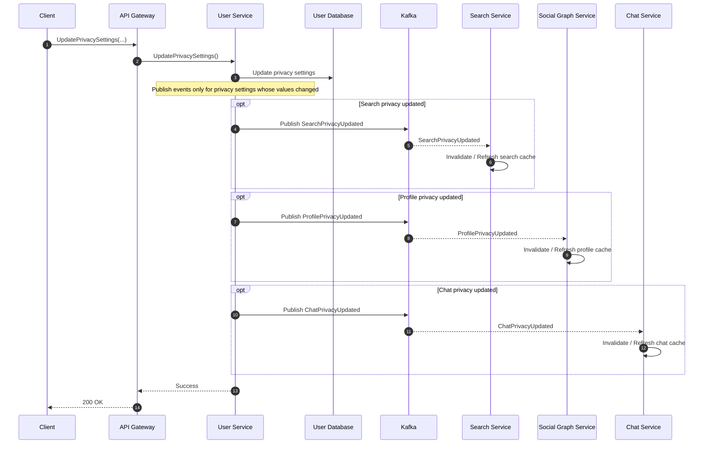

# Privacy Settings Update Flow

```mermaid
sequenceDiagram
    autonumber

    participant Client
    participant Gateway as API Gateway
    participant User as User Service
    participant UserDB as User Database
    participant Kafka
    participant Search as Search Service
    participant Social as Social Graph Service
    participant Chat as Chat Service

    Client->>Gateway: UpdatePrivacySettings(...)
    Gateway->>User: UpdatePrivacySettings()

    User->>UserDB: Update privacy settings

    Note over User: Publish events only for privacy settings whose values changed

    opt Search privacy updated
        User->>Kafka: Publish SearchPrivacyUpdated
        Kafka-->>Search: SearchPrivacyUpdated
        Search->>Search: Invalidate / Refresh search cache
    end

    opt Profile privacy updated
        User->>Kafka: Publish ProfilePrivacyUpdated
        Kafka-->>Social: ProfilePrivacyUpdated
        Social->>Social: Invalidate / Refresh profile cache
    end

    opt Chat privacy updated
        User->>Kafka: Publish ChatPrivacyUpdated
        Kafka-->>Chat: ChatPrivacyUpdated
        Chat->>Chat: Invalidate / Refresh chat cache
    end

    User-->>Gateway: Success
    Gateway-->>Client: 200 OK
```
