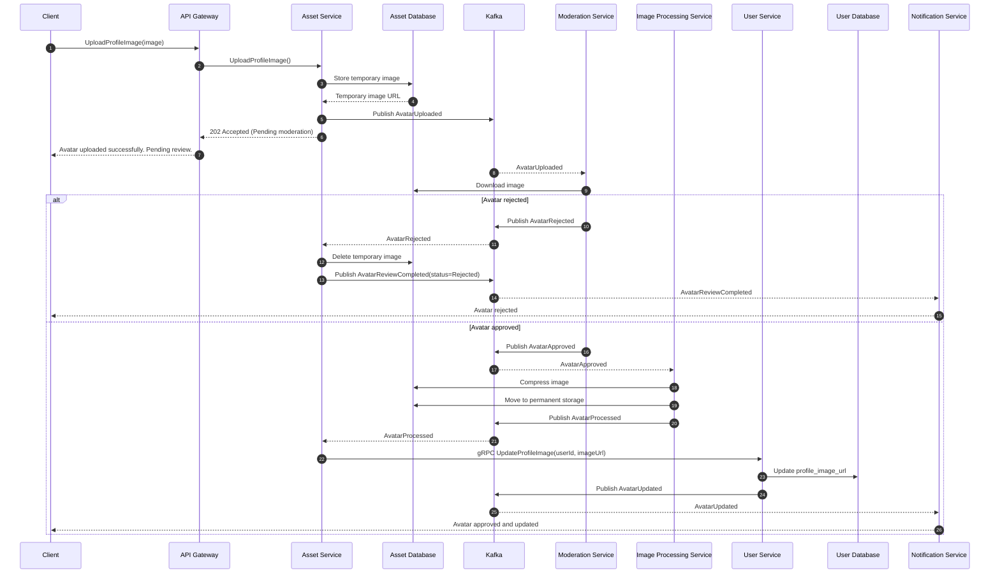

# Profile Image Update Flow

```mermaid
sequenceDiagram
    autonumber

    participant Client
    participant Gateway as API Gateway
    participant Asset as Asset Service
    participant AssetDB as Asset Database
    participant Kafka
    participant Moderation as Moderation Service
    participant Processor as Image Processing Service
    participant User as User Service
    participant UserDB as User Database
    participant Notification as Notification Service

    Client->>Gateway: UploadProfileImage(image)
    Gateway->>Asset: UploadProfileImage()

    Asset->>AssetDB: Store temporary image
    AssetDB-->>Asset: Temporary image URL

    Asset->>Kafka: Publish AvatarUploaded

    Asset-->>Gateway: 202 Accepted (Pending moderation)
    Gateway-->>Client: Avatar uploaded successfully. Pending review.

    Kafka-->>Moderation: AvatarUploaded

    Moderation->>AssetDB: Download image

    alt Avatar rejected

        Moderation->>Kafka: Publish AvatarRejected

        Kafka-->>Asset: AvatarRejected

        Asset->>AssetDB: Delete temporary image

        Asset->>Kafka: Publish AvatarReviewCompleted(status=Rejected)

        Kafka-->>Notification: AvatarReviewCompleted

        Notification-->>Client: Avatar rejected

    else Avatar approved

        Moderation->>Kafka: Publish AvatarApproved

        Kafka-->>Processor: AvatarApproved

        Processor->>AssetDB: Compress image
        Processor->>AssetDB: Move to permanent storage

        Processor->>Kafka: Publish AvatarProcessed

        Kafka-->>Asset: AvatarProcessed

        Asset->>User: gRPC UpdateProfileImage(userId, imageUrl)

        User->>UserDB: Update profile_image_url

        User->>Kafka: Publish AvatarUpdated

        Kafka-->>Notification: AvatarUpdated

        Notification-->>Client: Avatar approved and updated

    end
```
