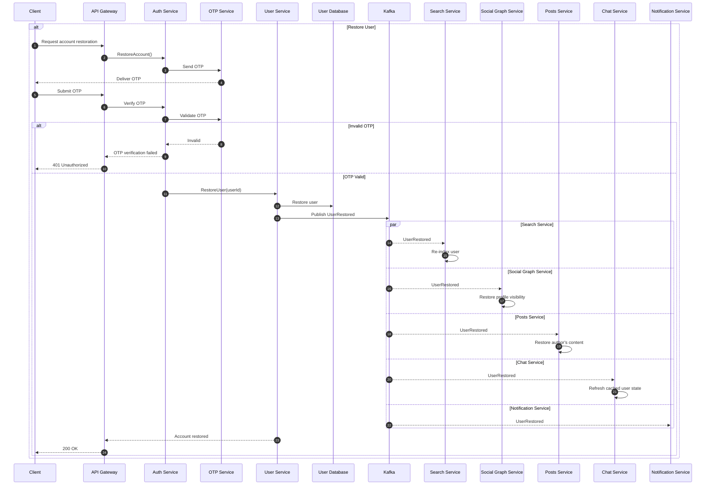

# Restore User Flow

```mermaid
sequenceDiagram
    autonumber

    participant Client
    participant Gateway as API Gateway
    participant Auth as Auth Service
    participant OTP as OTP Service
    participant User as User Service
    participant UserDB as User Database
    participant Kafka
    participant Search as Search Service
    participant Social as Social Graph Service
    participant Posts as Posts Service
    participant Chat as Chat Service
    participant Notification as Notification Service

    alt Restore User

        Client->>Gateway: Request account restoration
        Gateway->>Auth: RestoreAccount()

        Auth->>OTP: Send OTP
        OTP-->>Client: Deliver OTP

        Client->>Gateway: Submit OTP
        Gateway->>Auth: Verify OTP

        Auth->>OTP: Validate OTP

        alt Invalid OTP
            OTP-->>Auth: Invalid
            Auth-->>Gateway: OTP verification failed
            Gateway-->>Client: 401 Unauthorized

        else OTP Valid

            Auth->>User: RestoreUser(userId)

            User->>UserDB: Restore user

            User->>Kafka: Publish UserRestored

            par Search Service
                Kafka-->>Search: UserRestored
                Search->>Search: Re-index user
            and Social Graph Service
                Kafka-->>Social: UserRestored
                Social->>Social: Restore profile visibility
            and Posts Service
                Kafka-->>Posts: UserRestored
                Posts->>Posts: Restore author's content
            and Chat Service
                Kafka-->>Chat: UserRestored
                Chat->>Chat: Refresh cached user state
            and Notification Service
                Kafka-->>Notification: UserRestored
            end

            User-->>Gateway: Account restored
            Gateway-->>Client: 200 OK
        end

    end
```
