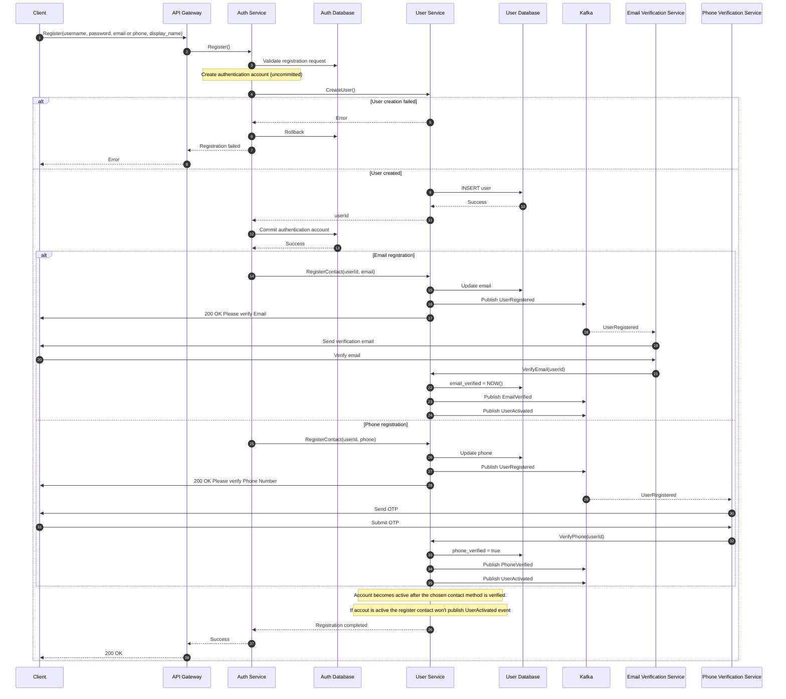

# User Creation Sequence Diagram

```mermaid
sequenceDiagram
    autonumber

    participant Client
    participant Gateway as API Gateway
    participant Auth as Auth Service
    participant AuthDB as Auth Database
    participant User as User Service
    participant UserDB as User Database
    participant Kafka
    participant Email as Email Verification Service
    participant Phone as Phone Verification Service

    Client->>Gateway: Register(username, password, email or phone, display_name)
    Gateway->>Auth: Register()

    Auth->>AuthDB: Validate registration request

    Note over Auth: Create authentication account (uncommitted)

    Auth->>User: CreateUser()

    alt User creation failed
        User-->>Auth: Error
        Auth->>AuthDB: Rollback
        Auth-->>Gateway: Registration failed
        Gateway-->>Client: Error

    else User created

        User->>UserDB: INSERT user
        UserDB-->>User: Success

        User-->>Auth: userId

        Auth->>AuthDB: Commit authentication account
        AuthDB-->>Auth: Success

        alt Email registration
            Auth->>User: RegisterContact(userId, email)
            User->>UserDB: Update email
            User->>Kafka: Publish UserRegistered
            User->>Client: 200 OK Please verify Email
            Kafka-->>Email: UserRegistered
            Email->>Client: Send verification email

            Client->>Email: Verify email
            Email->>User: VerifyEmail(userId)
            User->>UserDB: email_verified = NOW()
            User->>Kafka: Publish EmailVerified
            User->>Kafka: Publish UserActivated

        else Phone registration
            Auth->>User: RegisterContact(userId, phone)
            User->>UserDB: Update phone
            User->>Kafka: Publish UserRegistered
            User->>Client: 200 OK Please verify Phone Number
            Kafka-->>Phone: UserRegistered
            Phone->>Client: Send OTP

            Client->>Phone: Submit OTP
            Phone->>User: VerifyPhone(userId)
            User->>UserDB: phone_verified = true
            User->>Kafka: Publish PhoneVerified
            User->>Kafka: Publish UserActivated
        end

        Note over User: Account becomes active after the chosen contact method is verified.
        Note over User: If accout is active the register contact won't publish UserActivated event
        User-->>Auth: Registration completed
        Auth-->>Gateway: Success
        Gateway-->>Client: 200 OK
    end
```
