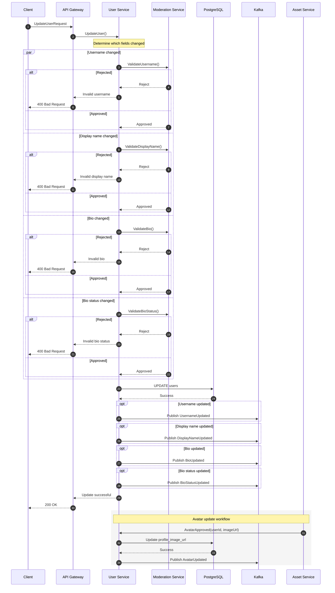

# Update User Sequence Diagram

```mermaid
sequenceDiagram
    autonumber

    participant Client
    participant Gateway as API Gateway
    participant User as User Service
    participant Moderation as Moderation Service
    participant DB as PostgreSQL
    participant Kafka
    participant Asset as Asset Service

    Client->>Gateway: UpdateUserRequest
    Gateway->>User: UpdateUser()

    Note over User: Determine which fields changed

    par Username changed
        User->>Moderation: ValidateUsername()
        alt Rejected
            Moderation-->>User: Reject
            User-->>Gateway: Invalid username
            Gateway-->>Client: 400 Bad Request
        else Approved
            Moderation-->>User: Approved
        end

    and Display name changed
        User->>Moderation: ValidateDisplayName()
        alt Rejected
            Moderation-->>User: Reject
            User-->>Gateway: Invalid display name
            Gateway-->>Client: 400 Bad Request
        else Approved
            Moderation-->>User: Approved
        end

    and Bio changed
        User->>Moderation: ValidateBio()
        alt Rejected
            Moderation-->>User: Reject
            User-->>Gateway: Invalid bio
            Gateway-->>Client: 400 Bad Request
        else Approved
            Moderation-->>User: Approved
        end

    and Bio status changed
        User->>Moderation: ValidateBioStatus()
        alt Rejected
            Moderation-->>User: Reject
            User-->>Gateway: Invalid bio status
            Gateway-->>Client: 400 Bad Request
        else Approved
            Moderation-->>User: Approved
        end
    end

    User->>DB: UPDATE users
    DB-->>User: Success

    opt Username updated
        User->>Kafka: Publish UsernameUpdated
    end

    opt Display name updated
        User->>Kafka: Publish DisplayNameUpdated
    end

    opt Bio updated
        User->>Kafka: Publish BioUpdated
    end

    opt Bio status updated
        User->>Kafka: Publish BioStatusUpdated
    end

    User-->>Gateway: Update successful
    Gateway-->>Client: 200 OK

    rect rgb(245,245,245)
        Note over Asset,User: Avatar update workflow

        Asset->>User: AvatarApproved(userId, imageUrl)
        User->>DB: Update profile_image_url
        DB-->>User: Success
        User->>Kafka: Publish AvatarUpdated
    end
```
